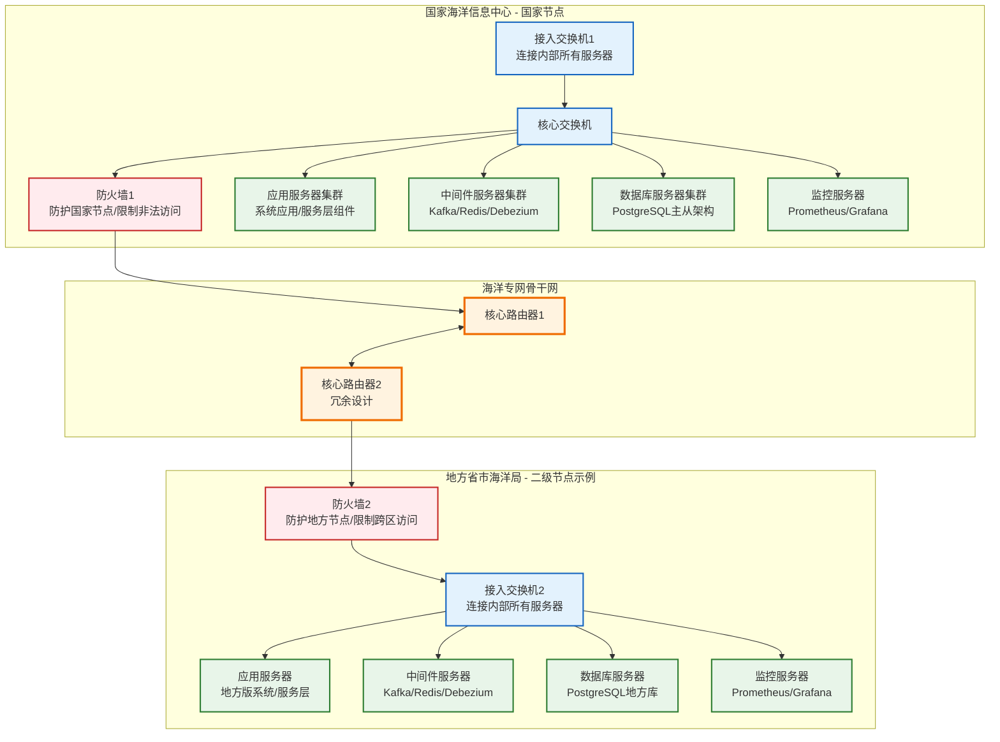

```mermaid
graph TD
    %% 定义样式
    classDef network fill:#e3f2fd,stroke:#1565c0,stroke-width:2px;
    classDef security fill:#ffebee,stroke:#c62828,stroke-width:2px;
    classDef server fill:#e8f5e9,stroke:#2e7d32,stroke-width:2px;
    classDef core fill:#fff3e0,stroke:#ef6c00,stroke-width:3px;

    subgraph NationNode [国家海洋信息中心 - 国家节点]
        direction TB
        N1[核心交换机]:::network
        N2[防火墙1<br/>防护国家节点/限制非法访问]:::security
        N3[应用服务器集群<br/>系统应用/服务层组件]:::server
        N4[中间件服务器集群<br/>Kafka/Redis/Debezium]:::server
        N5[数据库服务器集群<br/>PostgreSQL主从架构]:::server
        N6[监控服务器<br/>Prometheus/Grafana]:::server
        N7[接入交换机1<br/>连接内部所有服务器]:::network
        
        %% 内部连接
        N7 --> N1
        N1 --> N2
        N1 --> N3
        N1 --> N4
        N1 --> N5
        N1 --> N6
    end
    
    subgraph BackboneNet [海洋专网骨干网]
        direction LR
        M1[核心路由器1]:::core
        M2[核心路由器2<br/>冗余设计]:::core
        
        M1 <--> M2
    end
    
    subgraph LocalNode [地方省市海洋局 - 二级节点示例]
        direction TB
        L1[接入交换机2<br/>连接内部所有服务器]:::network
        L2[防火墙2<br/>防护地方节点/限制跨区访问]:::security
        L3[应用服务器<br/>地方版系统/服务层]:::server
        L4[中间件服务器<br/>Kafka/Redis/Debezium]:::server
        L5[数据库服务器<br/>PostgreSQL地方库]:::server
        L6[监控服务器<br/>Prometheus/Grafana]:::server
        
        %% 内部连接
        L2 --> L1
        L1 --> L3
        L1 --> L4
        L1 --> L5
        L1 --> L6
    end

    %% 跨节点骨干连接
    N2 --> M1
    M2 --> L2

    %% 布局优化提示
    NationNode ~~~ BackboneNet ~~~ LocalNode


```