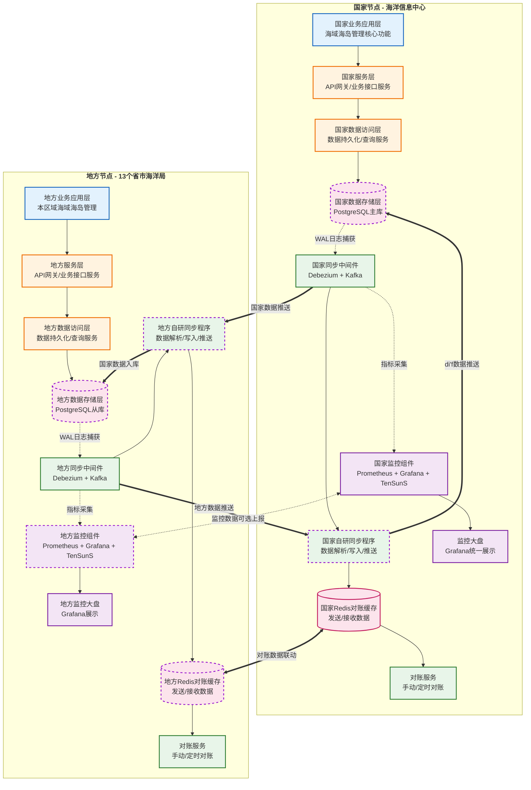

```mermaid
flowchart TD
    %% 定义样式
    classDef app fill:#e3f2fd,stroke:#1565c0,stroke-width:2px;
    classDef service fill:#fff3e0,stroke:#ef6c00,stroke-width:2px;
    classDef data fill:#fce4ec,stroke:#c2185b,stroke-width:2px;
    classDef sync fill:#e8f5e9,stroke:#2e7d32,stroke-width:2px;
    classDef monitor fill:#f3e5f5,stroke:#7b1fa2,stroke-width:2px;
    classDef linkLine stroke:#950DCD,stroke-width:2px,stroke-dasharray: 5 5;

    %% 国家节点 - 修复了标题括号问题
    subgraph NationNode [<B>国家节点 - 海洋信息中心]
        direction TB
        A1[国家业务应用层<br/>海域海岛管理核心功能]:::app
        B1[国家服务层<br/>API网关/业务接口服务]:::service
        C1[国家数据访问层<br/>数据持久化/查询服务]:::service
        D1[(国家数据存储层<br/>PostgreSQL主库)]:::data
        E1[国家同步中间件<br/>Debezium + Kafka]:::sync
        F1[国家自研同步程序<br/>数据解析/写入/推送]:::sync
        G1[(国家Redis对账缓存<br/>发送/接收数据)]:::data
        H1[国家监控组件<br/>Prometheus + Grafana + TenSunS]:::monitor
        I1[对账服务<br/>手动/定时对账]:::sync
        J1[监控大盘<br/>Grafana统一展示]:::monitor

        A1 --> B1
        B1 --> C1
        C1 --> D1
        D1 -.->|WAL日志捕获 | E1
        E1 --> F1
        F1 --> G1
        E1 -.->|指标采集 | H1
        G1 --> I1
        H1 --> J1
    end
    
    %% 地方节点 - 修复了标题括号问题
    subgraph LocalNode [<B>地方节点 - 13个省市海洋局]
        direction TB
        A2[地方业务应用层<br/>本区域海域海岛管理]:::app
        B2[地方服务层<br/>API网关/业务接口服务]:::service
        C2[地方数据访问层<br/>数据持久化/查询服务]:::service
        D2[(地方数据存储层<br/>PostgreSQL从库)]:::data
        E2[地方同步中间件<br/>Debezium + Kafka]:::sync
        F2[地方自研同步程序<br/>数据解析/写入/推送]:::sync
        G2[(地方Redis对账缓存<br/>发送/接收数据)]:::data
        H2[地方监控组件<br/>Prometheus + Grafana + TenSunS]:::monitor
        I2[对账服务<br/>手动/定时对账]:::sync
        J2[地方监控大盘<br/>Grafana展示]:::monitor

        A2 --> B2
        B2 --> C2
        C2 --> D2
        D2 -.->|WAL日志捕获 | E2
        E2 --> F2
        F2 --> G2
        E2 -.->|指标采集 | H2
        G2 --> I2
        H2 --> J2
    end
    
    %% 跨节点交互
    E2 ==>|地方数据推送 | F1:::linkLine
    E1 ==>|国家数据推送 | F2:::linkLine
    G1 <==>|对账数据联动 | G2:::linkLine
    H1 <-.->|监控数据可选上报 | H2:::linkLine
    F2 ==>|国家数据入库 | D2:::linkLine
    F1 ==>|di'f数据推送 | D1:::linkLine
```