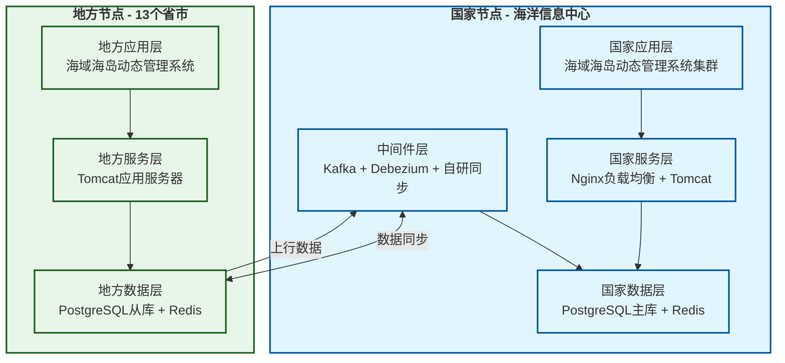

```mermaid
flowchart TD
    %% 定义样式
    classDef nation fill:#e1f5fe,stroke:#01579b,stroke-width:2px;
    classDef network fill:#fff3e0,stroke:#e65100,stroke-width:2px,stroke-dasharray: 5 5;
    classDef local fill:#e8f5e9,stroke:#1b5e20,stroke-width:2px;

    subgraph NationNode [<b>国家节点 - 海洋信息中心]
        direction TB
        A[国家应用层<br/>海域海岛动态管理系统集群]
        B[国家服务层<br/>Nginx负载均衡 + Tomcat]
        C[国家数据层<br/>PostgreSQL主库 + Redis]
        D[中间件层<br/>Kafka + Debezium + 自研同步]
        
        A --> B
        B --> C
        D --> C
    end
    

    
    subgraph LocalNode [<b>地方节点 - 13个省市]
        direction TB
        F[地方应用层<br/>海域海岛动态管理系统]
        G[地方服务层<br/>Tomcat应用服务器]
        H[地方数据层<br/>PostgreSQL从库 + Redis]
        
        F --> G
        G --> H
    end

    %% 跨子图连接 (连接具体节点而非子图名称)
    D <-->|数据同步 | H
    H -->|上行数据 | D

    %% 应用样式
    class NationNode,A,B,C,D nation;
    class SecureNet,E network;
    class LocalNode,F,G,H local;
    


```