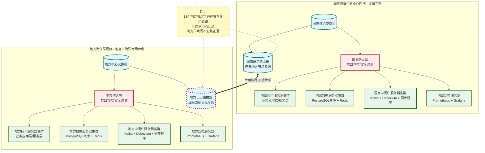

```mermaid
flowchart TD
    %% 定义基础样式
    classDef net fill:#e0f7fa,stroke:#006064,stroke-width:2px;
    classDef sec fill:#ffebee,stroke:#b71c1c,stroke-width:2px;
    classDef srv fill:#e8f5e9,stroke:#1b5e20,stroke-width:2px;
    classDef noteStyle fill:#fff9c4,stroke:#fbc02d,stroke-width:1px,stroke-dasharray: 3 3;
    classDef linkLine stroke:#950DCD,stroke-width:3px,stroke-dasharray: 5 5;

    %% 【修复点1】subgraph 标题去除中文括号，改用 "名称 - 描述" 格式，并用方括号包裹
    subgraph NationNet [国家海洋信息中心网络 - 海洋专网]
        direction TB
        N1[("国家核心交换机")]:::net
        N2["国家防火墙<br/>端口管控/安全过滤"]:::sec
        N3["国家应用服务器集群<br/>业务应用层/服务层"]:::srv
        N4["国家数据服务器集群<br/>PostgreSQL主库 + Redis"]:::srv
        N5["国家中间件服务器集群<br/>Kafka + Debezium + 同步程序"]:::srv
        N6["国家监控服务器<br/>Prometheus + Grafana"]:::srv
        N7[("国家出口路由器<br/>连接地方节点专网")]:::net

        N1 --> N2
        N2 --> N3
        N2 --> N4
        N2 --> N5
        N2 --> N6
        N1 --> N7
    end
    
    subgraph LocalNet [地方海洋局网络 - 各省市海洋专网示例]
        direction TB
        M1[("地方核心交换机")]:::net
        M2["地方防火墙<br/>端口管控/安全过滤"]:::sec
        M3["地方应用服务器集群<br/>业务应用层/服务层"]:::srv
        M4["地方数据服务器集群<br/>PostgreSQL从库 + Redis"]:::srv
        M5["地方中间件服务器集群<br/>Kafka + Debezium + 同步程序"]:::srv
        M6["地方监控服务器<br/>Prometheus + Grafana"]:::srv
        M7[("地方出口路由器<br/>连接国家节点专网")]:::net

        M1 --> M2
        M2 --> M3
        M2 --> M4
        M2 --> M5
        M2 --> M6
        M1 --> M7
    end
    
    %% 跨节点连接
    N7 <==>|专用链路/加密传输 | M7:::linkLine
    
    %% 【修复点2】将孤立注释改为关联注释，用虚线连接到链路两端
    NoteText[<b>注：</b><br/>13个地方节点均通过独立专用链路<br/>与国家节点互通<br/>地方节点间不直接互通]:::noteStyle
    NoteText -.- N7
    NoteText -.- M7


```