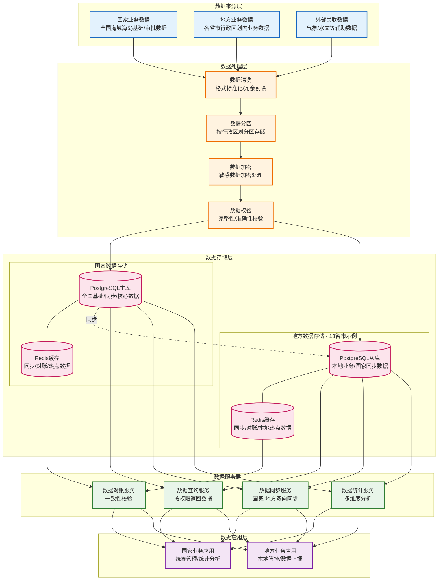

```mermaid
flowchart TD
    %% 定义样式
    classDef source fill:#e3f2fd,stroke:#1565c0,stroke-width:2px;
    classDef process fill:#fff3e0,stroke:#ef6c00,stroke-width:2px;
    classDef storage fill:#fce4ec,stroke:#c2185b,stroke-width:2px;
    classDef service fill:#e8f5e9,stroke:#2e7d32,stroke-width:2px;
    classDef app fill:#f3e5f5,stroke:#7b1fa2,stroke-width:2px;
    
    %% 1. 数据来源层
    subgraph SourceLayer [数据来源层]
        direction TB
        S1[国家业务数据<br/>全国海域海岛基础/审批数据]:::source
        S2[地方业务数据<br/>各省市行政区划内业务数据]:::source
        S3[外部关联数据<br/>气象/水文等辅助数据]:::source
    end
    
    %% 2. 数据处理层
    subgraph ProcessLayer [数据处理层]
        direction TB
        P1[数据清洗<br/>格式标准化/冗余剔除]:::process
        P2[数据分区<br/>按行政区划分区存储]:::process
        P3[数据加密<br/>敏感数据加密处理]:::process
        P4[数据校验<br/>完整性/准确性校验]:::process
        
        P1 --> P2 --> P3 --> P4
    end
    
    %% 3. 数据存储层 (修复嵌套子图标题)
    subgraph StorageLayer [数据存储层]
        direction TB
        
        subgraph NationStore [国家数据存储]
            D1[(PostgreSQL主库<br/>全国基础/同步/核心数据)]:::storage
            D2[(Redis缓存<br/>同步/对账/热点数据)]:::storage
            D1 --- D2
        end
        
        subgraph LocalStore [地方数据存储 - 13省市示例]
            D3[(PostgreSQL从库<br/>本地业务/国家同步数据)]:::storage
            D4[(Redis缓存<br/>同步/对账/本地热点数据)]:::storage
            D3 --- D4
        end
    end
    
    %% 4. 数据服务层
    subgraph ServiceLayer [数据服务层]
        direction TB
        SVC1[数据查询服务<br/>按权限返回数据]:::service
        SVC2[数据同步服务<br/>国家-地方双向同步]:::service
        SVC3[数据对账服务<br/>一致性校验]:::service
        SVC4[数据统计服务<br/>多维度分析]:::service
    end
    
    %% 5. 数据应用层
    subgraph AppLayer [数据应用层]
        direction TB
        A1[国家业务应用<br/>统筹管理/统计分析]:::app
        A2[地方业务应用<br/>本地管控/数据上报]:::app
    end

    %% 连线逻辑
    %% 来源 -> 处理
    S1 & S2 & S3 --> P1
    
    %% 处理 -> 存储
    P4 --> D1
    P4 --> D3
    
    %% 存储内部交互 (可选，视具体架构而定，此处表示主从或缓存交互)
    D1 -.->|同步 | D3
    
    %% 存储 -> 服务
    D1 & D3 --> SVC1
    D1 & D3 --> SVC2
    D2 & D4 --> SVC3
    D1 & D3 --> SVC4
    
    %% 服务 -> 应用
    SVC1 --> A1 & A2
    SVC2 --> A1 & A2
    SVC3 --> A1 & A2
    SVC4 --> A1 & A2


```