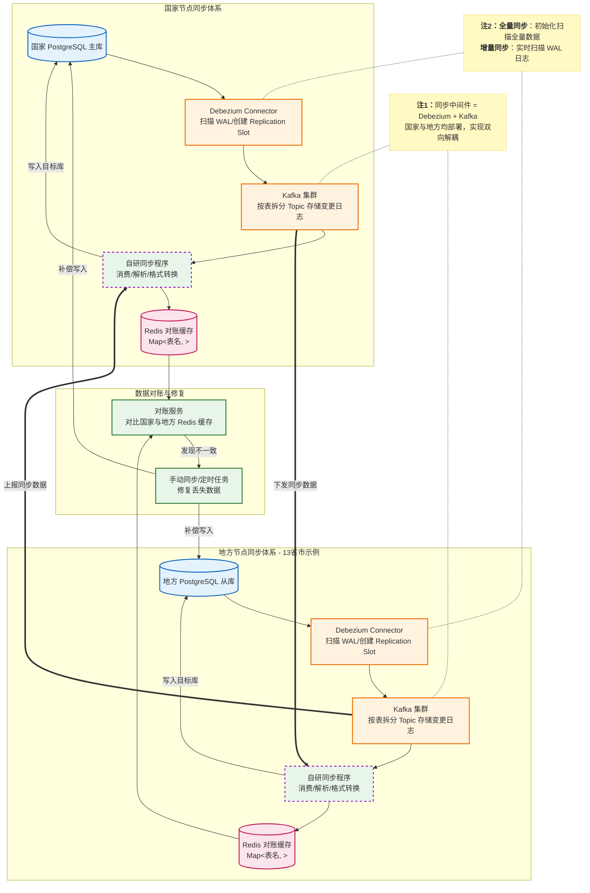

```mermaid
flowchart TD
    %% 定义样式
    classDef db fill:#e3f2fd,stroke:#1565c0,stroke-width:2px,shape:cylinder;
    classDef middleware fill:#fff3e0,stroke:#ef6c00,stroke-width:2px;
    classDef app fill:#e8f5e9,stroke:#2e7d32,stroke-width:2px;
    classDef cache fill:#fce4ec,stroke:#c2185b,stroke-width:2px,shape:database;
    classDef noteStyle fill:#fff9c4,stroke:#fbc02d,stroke-width:1px,stroke-dasharray: 3 3;
    classDef linkSync stroke:#950DCD,stroke-width:2px,stroke-dasharray: 5 5;

    %% 1. 国家节点同步体系
    subgraph NationSync [国家节点同步体系]
        direction TB
        N_DB[(国家 PostgreSQL 主库)]:::db
        N_Dez[Debezium Connector<br/>扫描 WAL/创建 Replication Slot]:::middleware
        N_Kafka[Kafka 集群<br/>按表拆分 Topic 存储变更日志]:::middleware
        N_App[自研同步程序<br/>消费/解析/格式转换]:::app
        N_Redis[(Redis 对账缓存<br/>Map<表名, <UUID, MD5>>)]:::cache
        
        N_DB --> N_Dez
        N_Dez --> N_Kafka
        N_Kafka --> N_App
        N_App --> N_Redis
        N_App -->|写入目标库 | N_DB
    end
    
    %% 2. 地方节点同步体系 (修复标题括号)
    subgraph LocalSync [地方节点同步体系 - 13省市示例]
        direction TB
        L_DB[(地方 PostgreSQL 从库)]:::db
        L_Dez[Debezium Connector<br/>扫描 WAL/创建 Replication Slot]:::middleware
        L_Kafka[Kafka 集群<br/>按表拆分 Topic 存储变更日志]:::middleware
        L_App[自研同步程序<br/>消费/解析/格式转换]:::app
        L_Redis[(Redis 对账缓存<br/>Map<表名, <UUID, MD5>>)]:::cache
        
        L_DB --> L_Dez
        L_Dez --> L_Kafka
        L_Kafka --> L_App
        L_App --> L_Redis
        L_App -->|写入目标库 | L_DB
    end

    %% 3. 双向同步链路
    %% 国家 -> 地方
    N_Kafka ==>|下发同步数据 | L_App:::linkSync
    %% 地方 -> 国家
    L_Kafka ==>|上报同步数据 | N_App:::linkSync

    %% 4. 对账与修复
    subgraph Reconciliation [数据对账与修复]
        R_Service[对账服务<br/>对比国家与地方 Redis 缓存]:::app
        R_Action[手动同步/定时任务<br/>修复丢失数据]:::app
    end

    N_Redis --> R_Service
    L_Redis --> R_Service
    R_Service -->|发现不一致 | R_Action
    R_Action -->|补偿写入 | N_DB
    R_Action -->|补偿写入 | L_DB

    %% 5. 注释说明 (关联到对应模块)
    Note1[<b>注1：</b>同步中间件 = Debezium + Kafka<br/>国家与地方均部署，实现双向解耦]:::noteStyle
    Note1 -.- N_Kafka
    Note1 -.- L_Kafka

    Note2[<b>注2：</b><b>全量同步</b>：初始化扫描全量数据<br/><b>增量同步</b>：实时扫描 WAL 日志]:::noteStyle
    Note2 -.- N_Dez
    Note2 -.- L_Dez


```