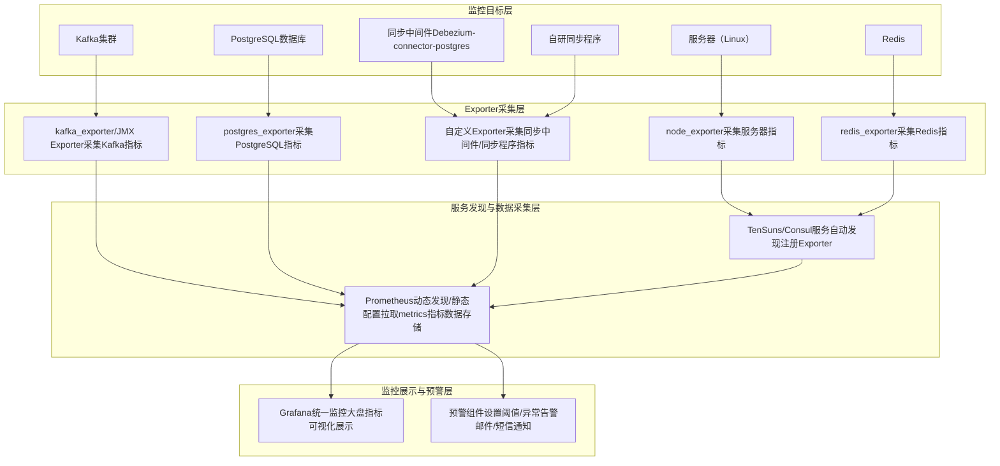

```mermaid

flowchart TD
    subgraph 监控目标层
        T1[服务器（Linux）]
        T2[Redis]
        T3[Kafka集群]
        T4[PostgreSQL数据库]
        T5[同步中间件Debezium-connector-postgres]
        T6[自研同步程序]
    end
    
    subgraph Exporter采集层
        E1[node_exporter采集服务器指标]
        E2[redis_exporter采集Redis指标]
        E3[kafka_exporter/JMX Exporter采集Kafka指标]
        E4[postgres_exporter采集PostgreSQL指标]
        E5[自定义Exporter采集同步中间件/同步程序指标]
    end
    
    subgraph 服务发现与数据采集层
        S1[TenSuns/Consul服务自动发现注册Exporter]
        S2[Prometheus动态发现/静态配置拉取metrics指标数据存储]
    end
    
    subgraph 监控展示与预警层
        G1[Grafana统一监控大盘指标可视化展示]
        A1[预警组件设置阈值/异常告警邮件/短信通知]
    end
    
    T1 --> E1
    T2 --> E2
    T3 --> E3
    T4 --> E4
    T5 --> E5
    T6 --> E5
    
    E1 --> S1
    E2 --> S1
    E3 --> S2
    E4 --> S2
    E5 --> S2
    
    S1 --> S2
    S2 --> G1
    S2 --> A1
    
```