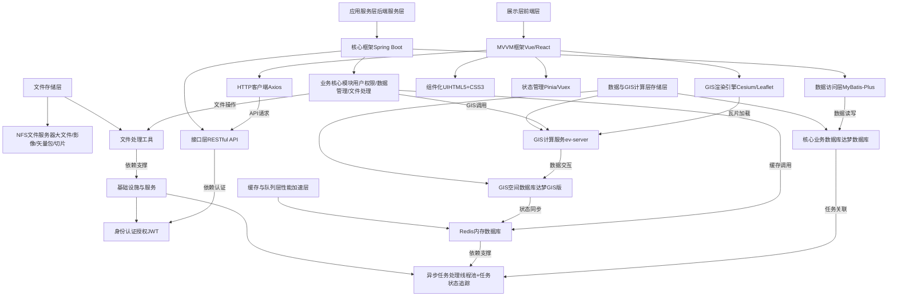

```mermaid
flowchart TB
        %% 最底层：基础设施与服务（基础支撑）
        F[基础设施与服务] --> F1[身份认证授权JWT]
        F --> F2[异步任务处理线程池+任务状态追踪]
        
        %% 第二层：文件存储层（非结构化数据存储）
        E[文件存储层] --> E1[NFS文件服务器大文件/影像/矢量包/切片]
        E --> E2[文件处理工具分块/校验/Excel批量处理]
        E2 -->|依赖支撑| F[基础设施与服务]
        
        %% 第三层：缓存与队列层（性能加速）
        D[缓存与队列层性能加速层] --> D1[Redis内存数据库]
        D1 -->|依赖支撑| F2[异步任务处理线程池+任务状态追踪]
        
        %% 第四层：数据与GIS计算层（核心数据存储与GIS处理）
        C[数据与GIS计算层存储层] --> C1[核心业务数据库达梦数据库]
        C --> C2[GIS空间数据库达梦GIS版]
        C --> C3[GIS计算服务ev-server要素与可视化服务器]
        C3 -->|数据交互| C2
        C2 -->|状态同步| D1[Redis内存数据库]
        C1 -->|任务关联| F2[异步任务处理线程池+任务状态追踪]
        
        %% 第五层：应用服务层（核心业务与接口）
        B[应用服务层后端服务层] --> B1[核心框架Spring Boot]
        B1 --> B2[数据访问层MyBatis-Plus]
        B1 --> B3[业务核心模块用户权限/数据管理/文件处理]
        B1 --> B4[接口层RESTful API]
        B2 -->|数据读写| C1[核心业务数据库达梦数据库]
        B3 -->|文件操作| E2[文件处理工具]
        B3 -->|缓存调用| D1[Redis内存数据库]
        B3 -->|GIS调用| C3[GIS计算服务ev-server]
        B4 -->|依赖认证| F1[身份认证授权JWT]
        
        %% 最上层：展示层（前端交互）
        A[展示层前端层] --> A1[MVVM框架Vue/React]
        A1 --> A2[组件化UIHTML5+CSS3]
        A1 --> A3[状态管理Pinia/Vuex]
        A1 --> A4[HTTP客户端Axios]
        A1 --> A5[GIS渲染引擎Cesium/Leaflet]
        A4 -->|API请求| B4[接口层RESTful API]
        A5 -->|瓦片加载| C3[GIS计算服务ev-server]
```