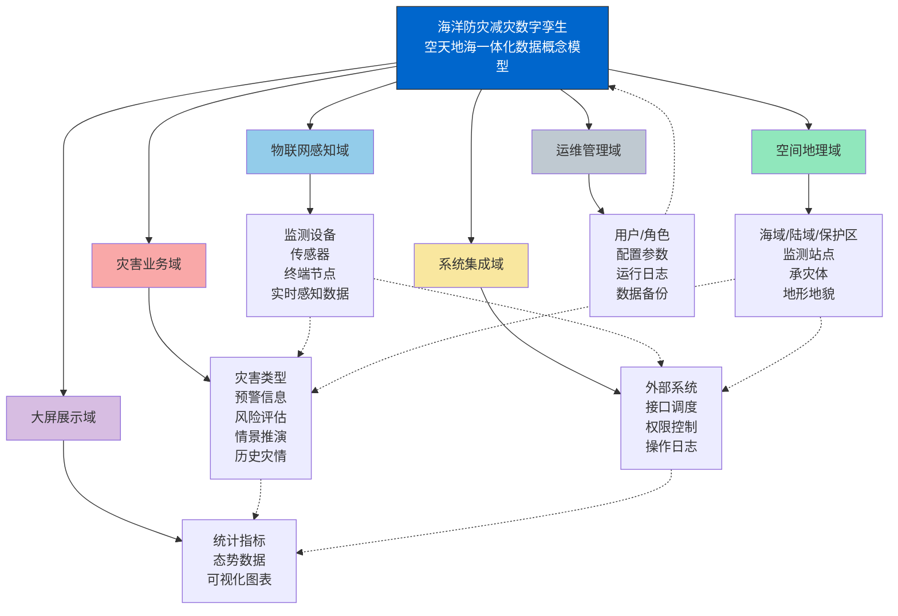

```mermaid
graph TD
    Core["海洋防灾减灾数字孪生<br/>空天地海一体化数据概念模型"]
    style Core fill:#0066cc,color:#fff,stroke:#333

    Domain1["物联网感知域"]
    Domain2["空间地理域"]
    Domain3["灾害业务域"]
    Domain4["系统集成域"]
    Domain5["大屏展示域"]
    Domain6["运维管理域"]

    style Domain1 fill:#93ccea
    style Domain2 fill:#90e7bc
    style Domain3 fill:#f9a8a8
    style Domain4 fill:#f9e79f
    style Domain5 fill:#d7bde2
    style Domain6 fill:#bfc9d1

    Sub1["监测设备<br/>传感器<br/>终端节点<br/>实时感知数据"]
    Sub2["海域/陆域/保护区<br/>监测站点<br/>承灾体<br/>地形地貌"]
    Sub3["灾害类型<br/>预警信息<br/>风险评估<br/>情景推演<br/>历史灾情"]
    Sub4["外部系统<br/>接口调度<br/>权限控制<br/>操作日志"]
    Sub5["统计指标<br/>态势数据<br/>可视化图表"]
    Sub6["用户/角色<br/>配置参数<br/>运行日志<br/>数据备份"]

    Core --> Domain1
    Core --> Domain2
    Core --> Domain3
    Core --> Domain4
    Core --> Domain5
    Core --> Domain6

    Domain1 --> Sub1
    Domain2 --> Sub2
    Domain3 --> Sub3
    Domain4 --> Sub4
    Domain5 --> Sub5
    Domain6 --> Sub6

    Sub1 -.-> Sub3
    Sub2 -.-> Sub3
    Sub3 -.-> Sub5
    Sub1 -.-> Sub4
    Sub2 -.-> Sub4
    Sub4 -.-> Sub5
    Sub6 -.-> Core
```