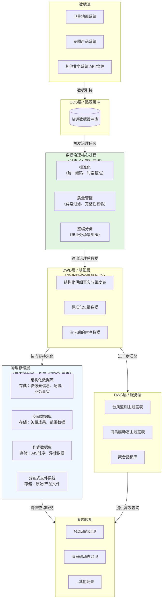

```mermaid
graph TD
    subgraph S [数据源]
        S1[卫星地面系统]
        S2[专题产品系统]
        S3[其他业务系统 API/文件]
    end

    subgraph ODS [ODS层 / 贴源缓冲]
        O1[(贴源数据缓冲库)]
    end

    subgraph GOV [数据治理核心过程<br>（对应《方案》要求）]
        G1[标准化<br>（统一编码、时空基准）]
        G2[质量管控<br>（异常过滤、完整性校验）]
        G3[整编分类<br>（按业务场景组织）]
    end

    subgraph DWD [DWD层 / 明细层<br>（即“治理好的存储数据”）]
        D1[结构化明细事实与维度表]
        D2[标准化矢量数据]
        D3[清洗后的时序数据]
    end

    subgraph STORE [物理存储层<br>（按内容分层， 对应《方案》要求）]
        T1[结构化数据库<br>存储：影像元信息、配置、业务事实]
        T2[空间数据库<br>存储：矢量成果、范围数据]
        T3[列式数据库<br>存储：AIS时序、浮标数据]
        T4[分布式文件系统<br>存储：原始/产品文件]
    end

    subgraph DWS [DWS层 / 服务层]
        W1[台风监测主题宽表]
        W2[海岛礁动态主题宽表]
        W3[聚合指标库]
    end

    subgraph APP [专题应用]
        A1[台风动态监测]
        A2[海岛礁动态监测]
        A3[...其他场景]
    end

    S -- 数据引接 --> ODS
    ODS -- 触发治理任务 --> GOV
    GOV -- 输出治理后数据 --> DWD
    DWD -- 按内容持久化 --> STORE
    DWD -- 进一步汇总 --> DWS
    STORE -- 提供查询服务 --> APP
    DWS -- 提供高效查询 --> APP

    style GOV fill:#e1f5e1,stroke:#333
    style STORE fill:#f0f8ff,stroke:#333

```