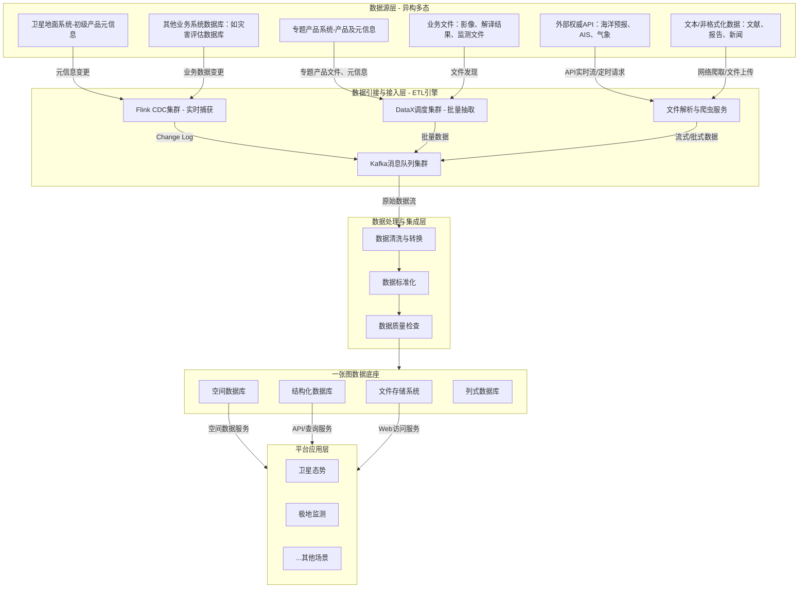

```mermaid
graph TD
    subgraph A [数据源层 - 异构多态]
        A1[卫星地面系统-初级产品元信息]
        A2[专题产品系统-产品及元信息]
        A3[其他业务系统数据库：如灾害评估数据库]
        A4[外部权威API：海洋预报、AIS、气象]
        A5[文本/非格式化数据：文献、报告、新闻]
        A6[业务文件：影像、解译结果、监测文件]
    end

    subgraph B [数据引接与接入层 - ETL引擎]
        B1[Flink CDC集群 - 实时捕获]
        B2[DataX调度集群 - 批量抽取]
        B3[Kafka消息队列集群]
        B4[文件解析与爬虫服务]
    end

    subgraph C [数据处理与集成层]
        C1[数据清洗与转换]
        C2[数据标准化]
        C3[数据质量检查]
    end

    subgraph D [一张图数据底座]
        D1[文件存储系统]
        D2[结构化数据库]
        D3[空间数据库]
        D4[列式数据库]
    end

    A1 -- 元信息变更 --> B1
    A2 -- 专题产品文件、元信息 --> B2
    A3 -- 业务数据变更 --> B1
    A4 -- API实时流/定时请求 --> B4
    A5 -- 网络爬取/文件上传 --> B4
    A6 -- 文件发现 --> B2

    B1 -->|Change Log| B3
    B2 -->|批量数据| B3
    B4 -->|流式/批式数据| B3

    B3 -->|原始数据流| C1
    C1 --> C2 --> C3 --> D

    D3 -->|空间数据服务| E
    D2 -->|API/查询服务| E
    D1 -->|Web访问服务| E

    subgraph E [平台应用层]
        E1[卫星态势]
        E2[极地监测]
        E3[...其他场景]
    end
```