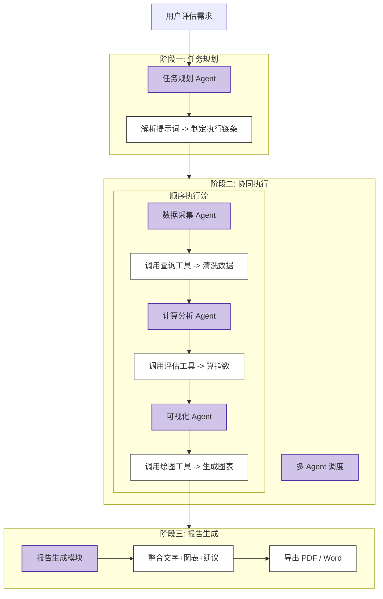

```mermaid
graph TD
    classDef agent fill:#d1c4e9,stroke:#512da8,stroke-width:1.5px;
    classDef action fill:#ffffff,stroke:#333,stroke-width:1px;

    Input[用户评估需求] --> Planner

    subgraph Stage1 [阶段一: 任务规划]
        Planner[任务规划 Agent]:::agent
        Logic[解析提示词 -> 制定执行链条]:::action
        Planner --> Logic
    end

    Logic --> Stage2

    subgraph Stage2 [阶段二: 协同执行]
        Coordinator[多 Agent 调度]:::agent
        
        subgraph Exe_Flow [顺序执行流]
            A1[数据采集 Agent]:::agent
            Do1[调用查询工具 -> 清洗数据]:::action
            
            A2[计算分析 Agent]:::agent
            Do2[调用评估工具 -> 算指数]:::action
            
            A3[可视化 Agent]:::agent
            Do3[调用绘图工具 -> 生成图表]:::action
            
            A1 --> Do1 --> A2 --> Do2 --> A3 --> Do3
        end
    end

    Do3 --> Stage3

    subgraph Stage3 [阶段三: 报告生成]
        Reporter[报告生成模块]:::agent
        Gen[整合文字+图表+建议]:::action
        Export[导出 PDF / Word]:::action
        
        Reporter --> Gen --> Export
    end
```