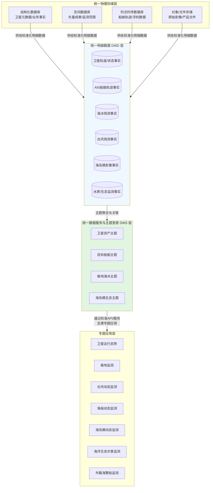

```mermaid
graph TD
    subgraph A [专题应用层]
        A1[卫星运行态势]
        A2[极地监测]
        A3[台风动态监测]
        A4[渔船动态监测]
        A5[海岛礁动态监测]
        A6[海洋生态灾害监测]
        A7[外籍海警船监测]
    end

    subgraph B [统一数据服务与主题宽表 DWS 层]
        B1[卫星资产主题]
        B2[海洋环境主题]
        B2[目标船舶主题]
        B4[极地海冰主题]
        B5[海岛礁生态主题]
    end

    subgraph C [统一明细数据 DWD 层]
        C1[(卫星轨道/状态事实)]
        C2[(AIS船舶轨迹事实)]
        C3[(海冰观测事实)]
        C4[(台风观测事实)]
        C5[(海岛礁影像事实)]
        C6[(水质/生态监测事实)]
    end

    subgraph D [统一物理存储层]
        D1[结构化数据库<br>卫星元数据/业务事实]
        D2[空间数据库<br>矢量成果/监测范围]
        D3[列式时序数据库<br>船舶轨迹/浮标数据]
        D4[对象/文件存储<br>原始影像/产品文件]
    end

    D1 & D2 & D3 & D4 -- 供给标准化明细数据 --> C
    C -- 主题聚合与关联 --> B
    B -- 通过标准API/服务 <br> 支撑专题应用 --> A
    
    style B fill:#e1f5e1
    style C fill:#f0f8ff
```